# 基本 BPMN 元素和建模方法

BPMN（Business Process Model and Notation，业务流程模型和注释）是流程建模的全球标准，是成功进行 Business-IT-Alignment（业务与 IT 一致性）的最重要组成部分之一。

BPMN 不是由某个企业主导的标准，而是由 [OMG](https://www.omg.org/) 制订的。OGM 制订了众多的国际标准，例如：UML。

Camunda BPM 实现了 BPMN 中的大部分建模方法。本文介绍基本的 BPMN 元素，及其在 Camunda BPM 中的使用方法。


## 基本的 BPMN 元素
| 名称                              |                             符号                             | 描述                                                         |
| --------------------------------- | :----------------------------------------------------------: | ------------------------------------------------------------ |
| None Start Event（空开始事件）    |  | 对**“无条件开始“**进行建模，通常一个流程都是从**”None Event“**开始的。 |
| Timer Start Event（定时开始事件） |  | **定时**启动流程。                                           |
| None End Event（空结束事件） |  | 对“无操作结束”进行建模，通常每个流程分支均应该结束于该事件。 |
| User Task（用户任务）    | 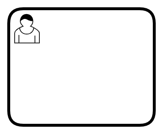 | 对由“人”完成的活动进行建模。         |
| Service Task（服务任务） | 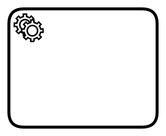 | 对由“计算机设备”完成的活动进行建模。 |
| Exclusive Gateway（排他网关） |  |  |


## 空开始事件

所有的流程都从一个**开始事件**开始，**空开始事件**要求用户手动启动一个流程，可以通过 `POST /process-definition/key/{key}/start` 来启动一个流程实例。

> 启动流程实例 API 的完整参数参见：[Start Process Instance](https://docs.camunda.org/manual/latest/reference/rest/process-definition/post-start-process-instance/)


## 定时开始事件

定时启动某个流程也是非常常见的流程模型，例如：每个工作日早上 7:00 开始起床流程、每个月的最后一天开始工资发放流程等。**定时开始事件**对这类流程的启动进行建模。

定时开始事件使用了 Camunda BPM 内置的定时器任务（Timer Job）机制，该定时器支持三种定时方式：

- **日期（Date）**：在指定的时间，触发一次**计时事件（Timer Event）**
- **持续时间（Duration）**：即延时，延时一段时间后，触发一次计时事件
- **周期（Cycle）**：按照定义的时间间隔，反复触发计时事件。

> 定时事件使用了  **Job** 机制，因此需要开启 **Job 执行器（Job Executor）**。采用 Docker 部署 Camunda BPM Run 时，Job 执行器默认是开启的。如果采用其它部署方式，需要修改配置文件开启 Job 执行器。


### 时间格式

时间必须符合 [ISO 8601](https://baike.baidu.com/item/ISO%208601) 格式。例如：

- 时间点：2021-01-12T07:30:10、2021-01-12T15:30:10+08
- 时间段：P1Y3M5DT6H7M30S（1 年 3 个月 5 天 6 小时 7 分 30 秒）
- 周期：R3/PT10H（每 10 小时重复一次，总共重复 3 次）


### 时区

定时器的时间匹配的是**“Camunda BPM 服务器时间/时区”**。在开发时，并不能知晓服务器时区设置是否正确。因此，为了避免错误的，开发者应使用 UTC 时间（例如：2021-01-12T15:30:00Z）或者 UTC 相对偏移时间（例如：2021-01-12T15:30:00+08）。

> Docker 部署时，Docker 会自动将宿主机的时间/时区同步到容器内。但是，仍然推荐使用以上的规则，来避免错误。


### 示例

- 在 Modeler 中建立以下的模型：

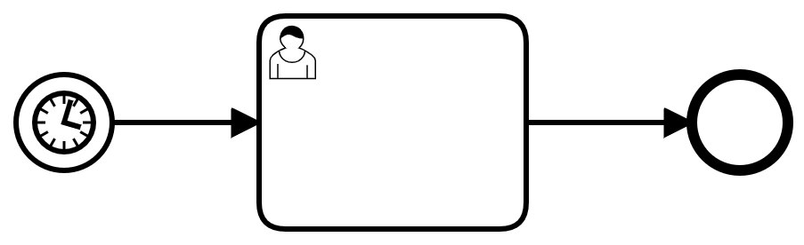

- 按以下方式设置 Timer Start Event 控件的参数：

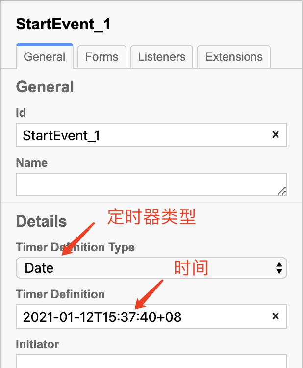

- 部署该流程后，无须做任何操作，当到达指定时间，该流程会自动启动一个实例。


## 空结束事件

**结束事件**标志一个流程的结束。**空结束事件**表示：直接结束流程，无须和其它流程交互。


## 用户任务

**用户任务**是对由人完成的活动进行建模。人通过应用系统与工作流引擎进行交互，完成：

- 用户任务的搜索
- 用户任务的认领
- 修改流程变量
- 用户任务的完成


### 任务分配

既然是由人完成的任务，首先要解决**“该任务由谁来完成”**。Camunda BPM 对 BPMN 的用户分配建模方法进行了扩展，引入了**执行人（Assignee）**、**候选人（Candiate Users）**、**候选组（Candiate Groups）**的概念。


#### 执行人（Assignee）

可以将用户任务直接分配给指定用户。


#### 候选人（Candiate Users）

可以设定允许执行该用户任务的多个用户，每个用户名之间用逗号隔开。可以同时设置候选人和候选组。


#### 候选组（Candiate Groups）

可以设定允许执行该用户任务的多个用户组，每个用户组名之间用逗号隔开。可以同时设置候选人和候选组。


> **注意：**在使用 Camunda Modeler 进行建模时，才可以直接设置以上属性。而使用其它建模软件时，则没有上述属性设置，只能通过修改 .bpmn 文件来设置这些属性。


#### 示例 - 静态分配用户任务

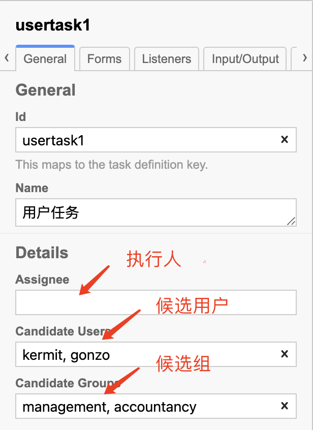


### 任务的动态分配

静态任务分配很多时候并不能满足业务逻辑要求。例如：

- 在设计流程时不知道执行人或候选人/组的确切名称
- 执行人不是一个确定值，而是取决于诸如“启动流程的人”之类的数据
- 任务分配逻辑可能很复杂，甚至需要访问外部数据源以实现查找，例如：“启动流程的员工的经理”

在 Node.js 开发中，可以使用过程变量来进行任务分配。


#### 示例 - 使用过程变量分配用户任务

建立以下的流程：

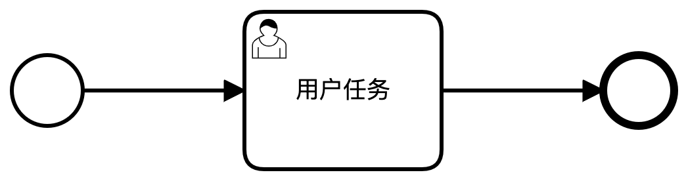

对 `usertask1` 做以下设置：

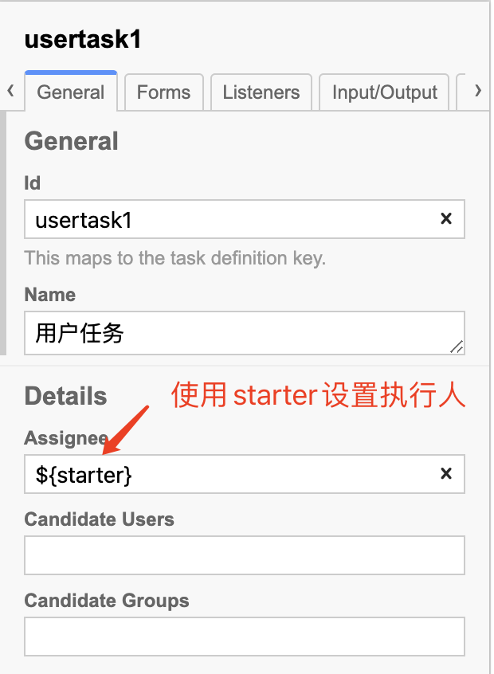

启动流程时，初始化 `starter` 流程变量，流程引擎会自动将 `usertask1` 分配给 “starter”。

```bash
curl -X POST -H "content-type: application/json" http://localhost:8080/engine-rest/process-definition/key/usertask-exp/start -d '{ "variables": { "starter": { "value": "kermit" } } }'
```

启动流程后，可以在 Cockpit 中进行观察：

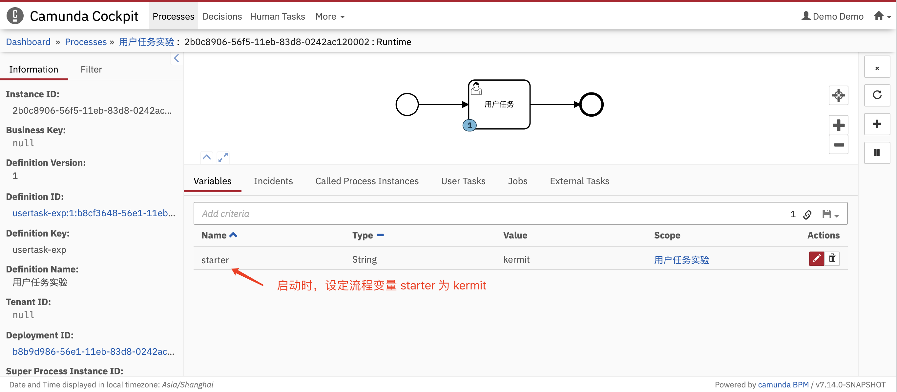

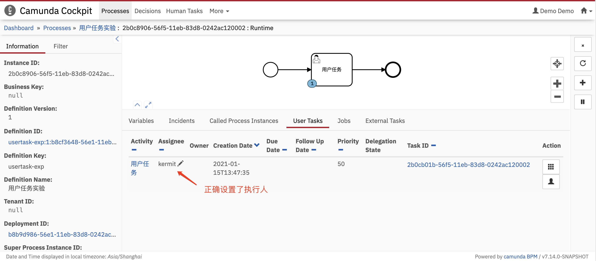


> 在引用流程变量 `starter` 时，使用的语法是：`${starter}`。事实上，并不能直接将流程变量赋值给“执行人”，只能使用**表达式**。Camunda BPM 支持 EL（Unified Expression Language，统一表达语言）。EL 是 JSP 2.1 规范的一部分，可以参考[EL 官方文档](https://docs.oracle.com/javaee/5/tutorial/doc/bnahq.html)。


### 用户任务的搜索

使用 API：[`POST /task`](https://docs.camunda.org/manual/latest/reference/rest/task/post-query/) 可以根据**执行人**、**候选用户**、**候选组**、**流程变量**等等条件综合搜索与自己相关的任务列表。如果任务列表很长，需要分页，可以先使用 API：[`POST /task/count`](https://docs.camunda.org/manual/latest/reference/rest/task/post-query-count/) 获取列表的长度。


### 用户任务的认领

在建模时，如果仅指定了”候选人/候选组“，那么相关人员都可以搜索到该任务。但是，同一任务不应该由多个人员同时操作，这将导致不可控的操作结果。因此，在操作用户任务前（修改流程变量前），应先将该任务认领到自己的名下，即设定执行人为自己。使用以下 API 可以完成认领操作：

- [`POST /task/{id}/claim`](https://docs.camunda.org/manual/latest/reference/rest/task/post-claim/)
- [`POST /task/{id}/assignee`](https://docs.camunda.org/manual/latest/reference/rest/task/post-assignee/)

这两个认领操作的区别是：

- `claim` 将检查该任务是否已经分配了执行人。适用于对“任务池抢单”分配模式的建模。
-  `assignee` 不执行这一检查，直接认领任务。适用于“管理员指定”分配模式的建模。


#### 示例 - 使用 `claim` 认领任务

在**”示例 - 使用过程变量分配用户任务“**启动后，执行以下命令：

```bash
curl -i -X POST -H "content-type: application/json" http://localhost:8080/engine-rest/task/2b0cb01b-56f5-11eb-83d8-0242ac120002/claim -d '{ "userId": "aUserId" }'
```

由于任务已经分配给了 `kermit`，因此会得到以下的响应：

```bash
HTTP/1.1 500
Access-Control-Allow-Origin: *
Content-Type: application/json
Content-Length: 130
Date: Fri, 15 Jan 2021 05:56:29 GMT
Connection: close

{"type":"TaskAlreadyClaimedException","message":"Task '2b0cb01b-56f5-11eb-83d8-0242ac120002' is already claimed by someone else."}
```

返回码为 `500`，并指出“该任务已经被分配给其他人”，认领不成功。


#### 示例 - 使用 `assignee` 认领任务

接着执行以下命令：

```bash
curl -i -X POST -H "content-type: application/json" http://localhost:8080/engine-rest/task/2b0cb01b-56f5-11eb-83d8-0242ac120002/assignee -d '{ "userId": "aUserId" }'
```

强制认领任务后，得到以下响应：

```bash
HTTP/1.1 204
Access-Control-Allow-Origin: *
Date: Fri, 15 Jan 2021 06:04:38 GMT
```

返回码为 `204`，表示认领成功。


#### 取消认领

使用 API：[`POST /task/{id}/unclaim`](https://docs.camunda.org/manual/latest/reference/rest/task/post-unclaim/) 将任务的执行人清空。


### 流程变量的更新

使用 API：[`POST /task/{id}/variables`](https://docs.camunda.org/manual/latest/reference/rest/task/variables/post-modify-task-variables/) 可以添加、编辑、删除流程变量。

### 用户任务的结束

使用 API：[`POST /task/{id}/complete`](https://docs.camunda.org/manual/latest/reference/rest/task/post-complete/) 可以结束当前用户任务，并更新流程变量。


## 服务任务

**服务任务**是对由计算机系统完成的活动进行建模。

Camunda BPM 支持 5 种服务的实现方式，Node.js 开发中，使用 **外部任务（External Tasks）**模式来实现服务。外部任务在概念上与用户任务非常相似，作为普通开发者可以将其类比于用户任务来考虑：

- 用户任务由流程引擎创建，并添加到任务列表中；“人”查询任务列表，并声明该任务的执行人；完成任务后向流程引擎声明任务完成，流程引擎推动流程继续。
- 外部任务由流程引擎创建，并添加到**主题（Topic）**列表中；外部应用程序查询主题，并锁定该主题；完成任务后，外部应用程序向流程引擎声明任务完成，流程引擎推动流程继续。

> 外部任务采用了**长轮询（Long Polling）**的机制，来减少请求数量，提高服务器和客户端资源的利用效率。关于 Camunda BPM 实现外部服务的细节，可以参考[官方文档 - External Tasks](https://docs.camunda.org/manual/latest/user-guide/process-engine/external-tasks/)。


### 使用 Node.js 开发外部任务

对于 Node.js 开发者，Camunda BPM 官方提供了 SDK - [camunda-external-task-client-js](https://github.com/camunda/camunda-external-task-client-js)，封装了实现外部服务的 API，简化了外部服务的开发工作。

Camunda External Task Client JS library 采用了发布-订阅模式：客户端**订阅（subcribe）**某个**主题（topic）**，并将其关联到一个异步服务。


### 示例 1 - 使用 Node.js 开发外部任务

建立以下的流程：

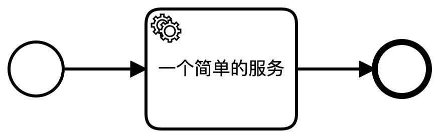

设置服务任务属性：

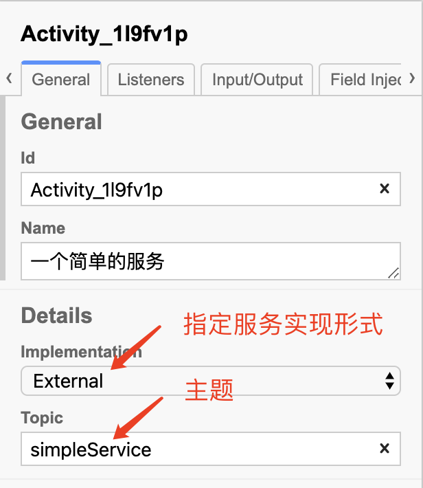

安装 Camunda External Task Client JS library：

```bash
npm install camunda-external-task-client-js
npm install console-stamp
```

外部服务代码（`externalTaskExpStep0.js`）：

```javascript
const { Client, logger } = require("camunda-external-task-client-js");
// 为控制台日志添加时间标签
require("console-stamp")(console);

// 配置客户端:
//  - 'baseUrl': 流程引擎的 URL
//  - 'logger': 日志记录
//  - 'asyncResponseTimeout': 长轮询超时时间（超时后，客户端会自动再次发起连接）
const config = {
  baseUrl: "http://localhost:8080/engine-rest",
  use: logger,
  asyncResponseTimeout: 5000
};

// 创建客户端实例
const client = new Client(config);

// 订阅主题: "simple-service"
client.subscribe("simple-service", async function ({ task, taskService }) {
  // 业务代码
  console.log("外部服务开始运行...");

  // 完成外部任务
  await taskService.complete(task);
  console.log("外部服务结束.");
});
```

运行服务代码：

```bash
node externalTaskExpStep0.js
```

启动一个流程实例后，可以在控制台得到如下输出：

```bash
[Sat Jan 16 2021 10:23:22] [LOG]    ✓ subscribed to topic simple-service
[Sat Jan 16 2021 10:23:22] [LOG]    外部服务开始运行...
[Sat Jan 16 2021 10:23:22] [LOG]    ✓ completed task 8d2b5354-57a1-11eb-9327-0242ac120003
[Sat Jan 16 2021 10:23:22] [LOG]    外部服务结束.
```


### 在外部任务中访问流程变量

和用户任务类似，外部任务通过读写流程变量与流程进行交互。

Camunda External Task Client JS library 中流程变量是只读的；在结束服务时，使用 `complete` API 来更新流程变量。


### 示例 2 - 在外部任务中访问流程变量

建立以下的流程模型，添加**用户任务**以方便观察流程变量：

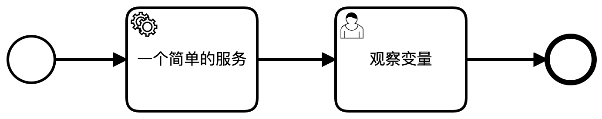

启动流程实例时，添加三个变量：实例标签（`label`）、数字1（`num1`）、数字2（`num2`）：

```bash
curl -X POST -H "content-type: application/json" http://localhost:8080/engine-rest/process-definition/key/service-task-exp/start -d '{"variables": {"label": {"value": "实例1"}, "num1": {"value": 2}, "num2": {"value": 3}}}'
```

外部服务代码（`externalTaskExpStep1.js`）：

```javascript
const config = {
  baseUrl: "http://localhost:8080/engine-rest",
  use: logger,
  asyncResponseTimeout: 5000
};

// 创建客户端实例
const client = new Client(config);

// 订阅主题: "simple-service"
client.subscribe("simple-service", async function ({ task, taskService }) {
  // 获取流程变量值
  const label = task.variables.get("label");
  console.log("[流程：%s] 外部服务开始运行...", label);

  const num1 = task.variables.get("num1");
  const num2 = task.variables.get("num2");

  // 构造流程变量值
  const processVariables = new Variables();
  processVariables.set("sum", num1 + num2);

  // 完成外部任务时，更新流程变量
  await taskService.complete(task, processVariables);
  console.log("[流程：%s] 外部服务结束.", label);
});
```

运行外部服务后，在控制台得到如下结果：

```bash
[Sat Jan 16 2021 11:53:55] [LOG]    ✓ subscribed to topic simple-service
[Sat Jan 16 2021 11:53:55] [LOG]    [流程：实例1] 外部服务开始运行...
[Sat Jan 16 2021 11:53:55] [LOG]    ✓ completed task 3365886d-57ae-11eb-9327-0242ac120003
[Sat Jan 16 2021 11:53:55] [LOG]    [流程：实例1] 外部服务结束.
```

在 Cockpit 中观察流程实例变量：

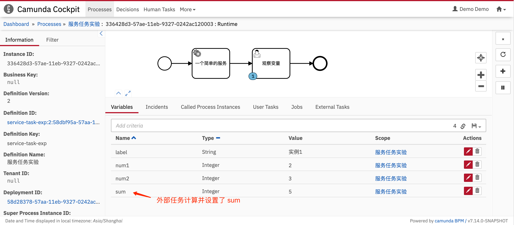


### 外部任务的可重入性

Camunda External Task Client JS library 采用了异步服务模式，因此外部任务服务是可重入的，即：上一次服务没有完成时，仍然可以响应下一次服务请求。这一设计保证了多个流程实例可以共享同一个外部任务服务。但是，由于 Node.js 是单线程的，因此在开发外部任务服务时，需要注意业务逻辑实现中同步/异步的区别。


### 示例 3 - 使用同步方式实现业务逻辑的外部任务

外部服务代码（`externalTaskExpStep2.js`）：

```javascript
const {
  Client,
  logger,
  Variables
} = require("camunda-external-task-client-js");
// 为控制台日志添加时间标签
require("console-stamp")(console);

// 配置客户端:
//  - 'baseUrl': 流程引擎的 URL
//  - 'logger': 日志记录
//  - 'asyncResponseTimeout': 长轮询超时时间（超时后，客户端会自动再次发起连接）
const config = {
  baseUrl: "http://localhost:8080/engine-rest",
  use: logger,
  asyncResponseTimeout: 5000
};

// 创建客户端实例
const client = new Client(config);

// 订阅主题: "simple-service"
client.subscribe("simple-service", async function ({ task, taskService }) {
  // 获取流程变量值
  const label = task.variables.get("label");
  console.log("[流程：%s] 外部服务开始运行...", label);

  // 让外部任务持续运行一段时间
  for (let i = 0; i < 10; i++) {
    // 模拟同步执行一段耗时的程序：
    // 同步延时一段时间，请根据 CPU 速度修改循环次数
    for (let j = 0; j < 50000; j++) {
      for (let k = 0; k < 100000; k++) {}
    }
    console.log("[流程：%s] 外部服务已循环 %d 次...", label, i);
  }

  // 完成外部任务时，更新流程变量
  await taskService.complete(task);
  console.log("[流程：%s] 外部服务结束.", label);
});
```

上述代码中，所有的业务逻辑均同步实现。相隔 3-5s 创建两个进程实例，分别命名为：`实例1`、`实例2`，会得到如下的结果：

```bash
[Sat Jan 16 2021 16:23:31] [LOG]    ✓ subscribed to topic simple-service
[Sat Jan 16 2021 16:23:35] [LOG]    [流程：实例1] 外部服务开始运行...
[Sat Jan 16 2021 16:23:38] [LOG]    [流程：实例1] 外部服务已循环 0 次...
[Sat Jan 16 2021 16:23:40] [LOG]    [流程：实例1] 外部服务已循环 1 次...
[Sat Jan 16 2021 16:23:41] [LOG]    [流程：实例1] 外部服务已循环 2 次...
[Sat Jan 16 2021 16:23:42] [LOG]    [流程：实例1] 外部服务已循环 3 次...
[Sat Jan 16 2021 16:23:44] [LOG]    [流程：实例1] 外部服务已循环 4 次...
[Sat Jan 16 2021 16:23:45] [LOG]    [流程：实例1] 外部服务已循环 5 次...
[Sat Jan 16 2021 16:23:46] [LOG]    [流程：实例1] 外部服务已循环 6 次...
[Sat Jan 16 2021 16:23:47] [LOG]    [流程：实例1] 外部服务已循环 7 次...
[Sat Jan 16 2021 16:23:48] [LOG]    [流程：实例1] 外部服务已循环 8 次...
[Sat Jan 16 2021 16:23:49] [LOG]    [流程：实例1] 外部服务已循环 9 次...
[Sat Jan 16 2021 16:23:49] [LOG]    ✓ completed task 20a835db-57d4-11eb-9327-0242ac120003
[Sat Jan 16 2021 16:23:49] [LOG]    [流程：实例1] 外部服务结束.
[Sat Jan 16 2021 16:23:50] [LOG]    [流程：实例2] 外部服务开始运行...
[Sat Jan 16 2021 16:23:52] [LOG]    [流程：实例2] 外部服务已循环 0 次...
[Sat Jan 16 2021 16:23:53] [LOG]    [流程：实例2] 外部服务已循环 1 次...
[Sat Jan 16 2021 16:23:54] [LOG]    [流程：实例2] 外部服务已循环 2 次...
[Sat Jan 16 2021 16:23:56] [LOG]    [流程：实例2] 外部服务已循环 3 次...
[Sat Jan 16 2021 16:23:57] [LOG]    [流程：实例2] 外部服务已循环 4 次...
[Sat Jan 16 2021 16:23:58] [LOG]    [流程：实例2] 外部服务已循环 5 次...
[Sat Jan 16 2021 16:23:59] [LOG]    [流程：实例2] 外部服务已循环 6 次...
[Sat Jan 16 2021 16:24:00] [LOG]    [流程：实例2] 外部服务已循环 7 次...
[Sat Jan 16 2021 16:24:01] [LOG]    [流程：实例2] 外部服务已循环 8 次...
[Sat Jan 16 2021 16:24:02] [LOG]    [流程：实例2] 外部服务已循环 9 次...
[Sat Jan 16 2021 16:24:02] [LOG]    ✓ completed task 23e1dd13-57d4-11eb-9327-0242ac120003
[Sat Jan 16 2021 16:24:02] [LOG]    [流程：实例2] 外部服务结束.
```

结果表明：

- 外部任务服务是可重入的。
- 当第一次服务未完成时，第二次服务请求会被延迟响应。
- 这将导致：如果业务逻辑很复杂，后请求服务的流程会被严重推迟！因此，要避免使用同步方式实现复杂逻辑。


### 示例 4 - 使用异步方式实现业务逻辑的外部任务

外部服务代码（`externalTaskExpStep3.js`）：

```javascript
const {
  Client,
  logger,
  Variables
} = require("camunda-external-task-client-js");
// 为控制台日志添加时间标签
require("console-stamp")(console);

// 配置客户端:
//  - 'baseUrl': 流程引擎的 URL
//  - 'logger': 日志记录
//  - 'asyncResponseTimeout': 长轮询超时时间（超时后，客户端会自动再次发起连接）
const config = {
  baseUrl: "http://localhost:8080/engine-rest",
  use: logger,
  asyncResponseTimeout: 5000
};

// 创建客户端实例
const client = new Client(config);

// 封装异步的 timeout 函数
const timeout = delayms => {
  return new Promise(resolve => {
    setTimeout(resolve, delayms);
  });
};

// 订阅主题: "simple-service"
client.subscribe("simple-service", async function ({ task, taskService }) {
  // 获取流程变量值
  const label = task.variables.get("label");
  console.log("[流程：%s] 外部服务开始运行...", label);

  // 让外部任务持续运行一段时间
  const end = 10;
  for (let i = 0; i < end; i++) {
    // 模拟异步执行一段耗时的程序：
    // 异步延时 1s
    await timeout(1000);
    console.log("[流程：%s] 外部服务已循环 %d 次...", label, i);
  }

  // 完成外部任务时，更新流程变量
  await taskService.complete(task);
  console.log("[流程：%s] 外部服务结束.", label);
});
```

上述代码中，长耗时的业务逻辑使用异步实现。相隔 3-5s 创建两个进程实例，分别命名为：`实例1`、`实例2`，会得到如下的结果：

```bash
[Sat Jan 16 2021 16:11:59] [LOG]    ✓ subscribed to topic simple-service
[Sat Jan 16 2021 16:12:05] [LOG]    [流程：实例1] 外部服务开始运行...
[Sat Jan 16 2021 16:12:06] [LOG]    [流程：实例1] 外部服务已循环 0 次...
[Sat Jan 16 2021 16:12:07] [LOG]    [流程：实例1] 外部服务已循环 1 次...
[Sat Jan 16 2021 16:12:08] [LOG]    [流程：实例1] 外部服务已循环 2 次...
[Sat Jan 16 2021 16:12:09] [LOG]    [流程：实例1] 外部服务已循环 3 次...
[Sat Jan 16 2021 16:12:10] [LOG]    [流程：实例2] 外部服务开始运行...
[Sat Jan 16 2021 16:12:10] [LOG]    [流程：实例1] 外部服务已循环 4 次...
[Sat Jan 16 2021 16:12:11] [LOG]    [流程：实例2] 外部服务已循环 0 次...
[Sat Jan 16 2021 16:12:11] [LOG]    [流程：实例1] 外部服务已循环 5 次...
[Sat Jan 16 2021 16:12:12] [LOG]    [流程：实例2] 外部服务已循环 1 次...
[Sat Jan 16 2021 16:12:12] [LOG]    [流程：实例1] 外部服务已循环 6 次...
[Sat Jan 16 2021 16:12:13] [LOG]    [流程：实例2] 外部服务已循环 2 次...
[Sat Jan 16 2021 16:12:13] [LOG]    [流程：实例1] 外部服务已循环 7 次...
[Sat Jan 16 2021 16:12:14] [LOG]    [流程：实例2] 外部服务已循环 3 次...
[Sat Jan 16 2021 16:12:14] [LOG]    [流程：实例1] 外部服务已循环 8 次...
[Sat Jan 16 2021 16:12:15] [LOG]    [流程：实例2] 外部服务已循环 4 次...
[Sat Jan 16 2021 16:12:15] [LOG]    [流程：实例1] 外部服务已循环 9 次...
[Sat Jan 16 2021 16:12:15] [LOG]    ✓ completed task 855c0109-57d2-11eb-9327-0242ac120003
[Sat Jan 16 2021 16:12:15] [LOG]    [流程：实例1] 外部服务结束.
[Sat Jan 16 2021 16:12:16] [LOG]    [流程：实例2] 外部服务已循环 5 次...
[Sat Jan 16 2021 16:12:17] [LOG]    [流程：实例2] 外部服务已循环 6 次...
[Sat Jan 16 2021 16:12:18] [LOG]    [流程：实例2] 外部服务已循环 7 次...
[Sat Jan 16 2021 16:12:19] [LOG]    [流程：实例2] 外部服务已循环 8 次...
[Sat Jan 16 2021 16:12:20] [LOG]    [流程：实例2] 外部服务已循环 9 次...
[Sat Jan 16 2021 16:12:20] [LOG]    ✓ completed task 885718a1-57d2-11eb-9327-0242ac120003
[Sat Jan 16 2021 16:12:20] [LOG]    [流程：实例2] 外部服务结束.
```

结果表明：

- 外部任务服务是可重入的。
- 使用异步实现业务逻辑时，所有服务请求均立即得到响应。
- 多个服务请求可同时运行。


### 关于外部任务可靠性的讨论

#### 外部任务服务先于工作流引擎启动

此时外部任务服务会一直尝试连接工作流引擎，直至连接成功。


#### 流程实例调用外部任务时，外部任务服务尚未启动

外部任务的执行逻辑和用户任务类似，工作流引擎执行到外部任务时，会自动挂起，直到外部任务服务调用 `complete` API。因此，当外部任务服务启动成功后，外部任务将正常执行。


#### 外部任务服务意外退出，没有正常结束任务

根据上面对外部任务执行逻辑的理解，当外部任务服务意外退出后重启外部服务，等同于“流程实例调用外部任务时，外部任务服务尚未启动“的情况。因此，只要外部任务服务重启，外部任务也将重新执行。此时：

- 由于流程变量只能在正常结束外部任务时被更新，因此如果外部任务业务逻辑只修改流程变量的话，这种重启是”无感“的，完全不会影响流程运行。
- 如果外部任务业务逻辑中需要向其它系统或数据库写入数据，那么重启外部任务服务后，这部分数据也将被重写，这有可能导致产生重复数据，需要开发者编写额外的业务逻辑来避免这种错误。


### 一个简单的 BPMN 流程图 - 发货流程

下图是一个电商的发货流程：

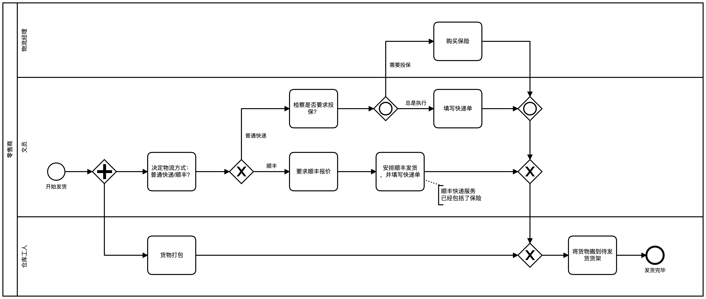

在此示例中，使用了**泳池（Pool）**和**泳道（Lane）**来对参与此流程的人员进行建模。工作流引擎将驱动该流程，分配用户任务，并负责人员之间（用户任务之间）的通信。开发者只需处理用户任务，而无需关注用户间的通信和流程的推进。


### 另一个简单的 BPMN 流程图 - 披萨协作

下面的示例中，我们对“点披萨的客户”和“披萨店”之间的交互进行显示建模。“客户”和“披萨店”被称之为**“参与者”**，各自拥有自己的泳池。

