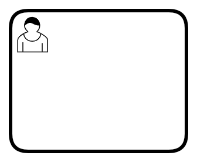
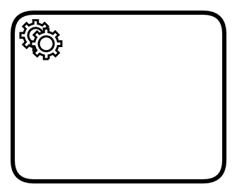
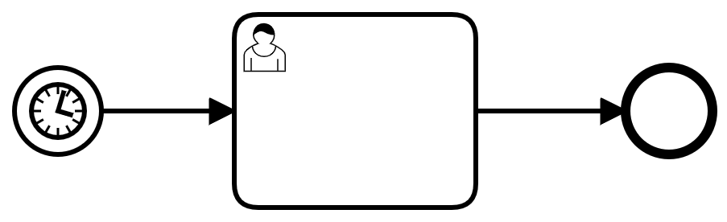
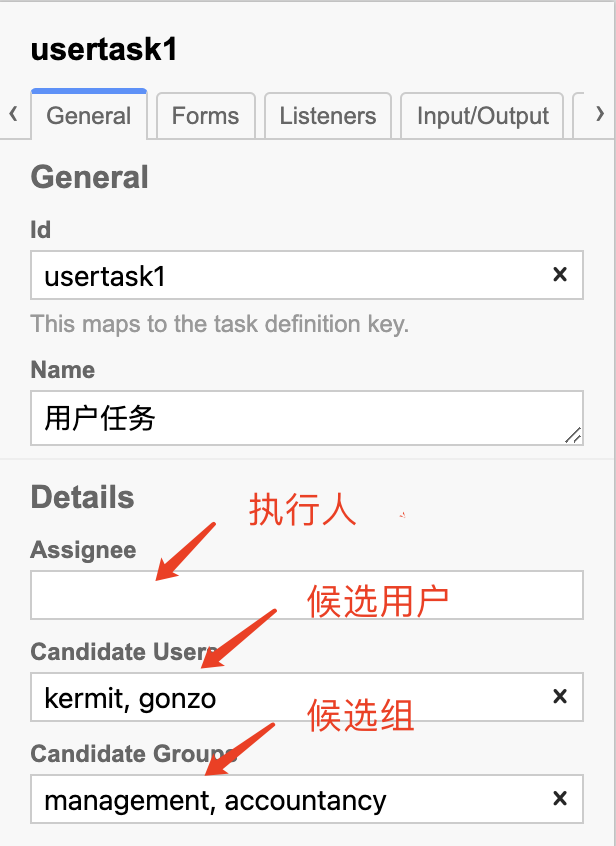
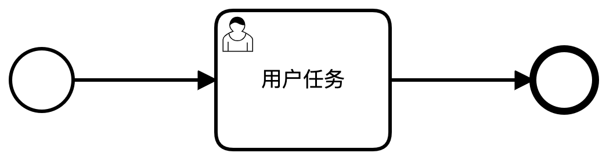
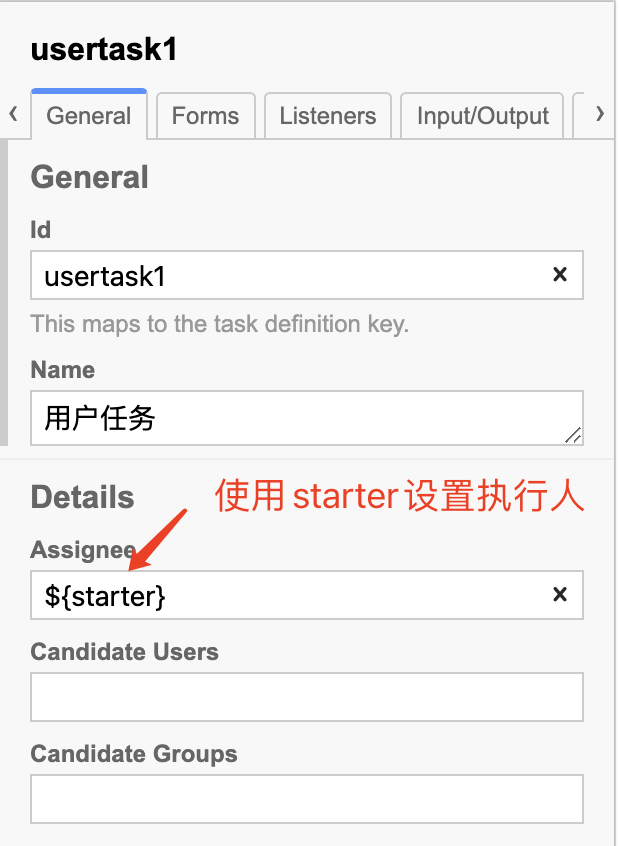
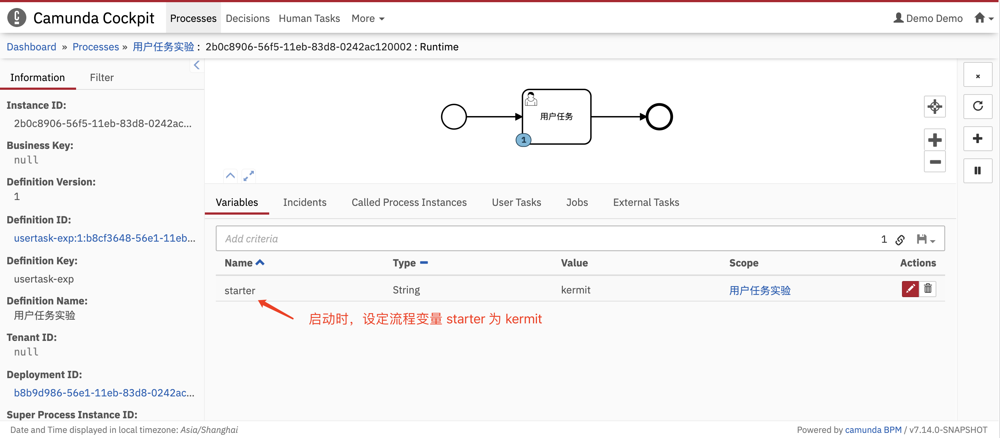
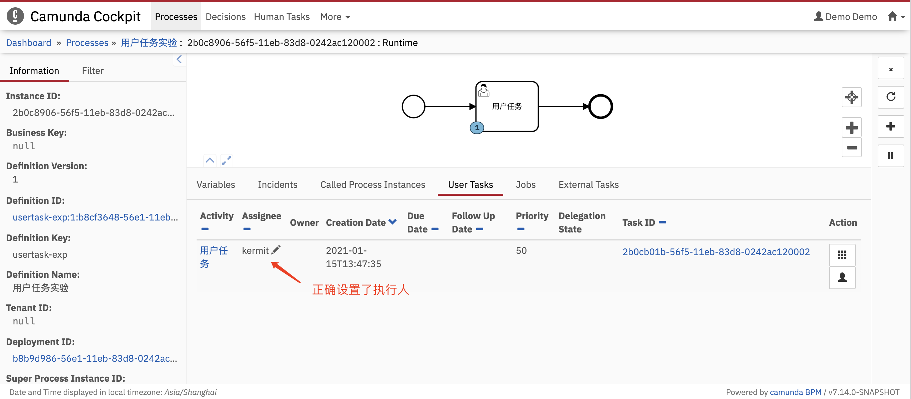
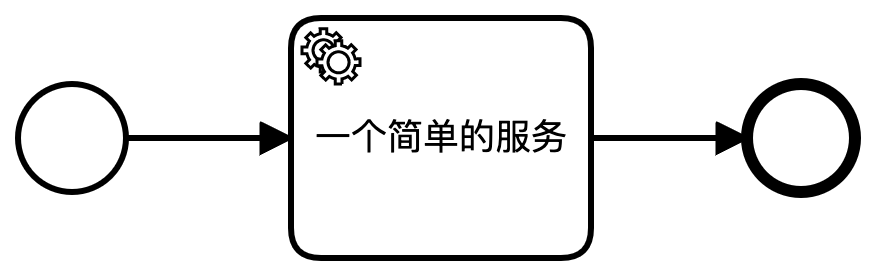
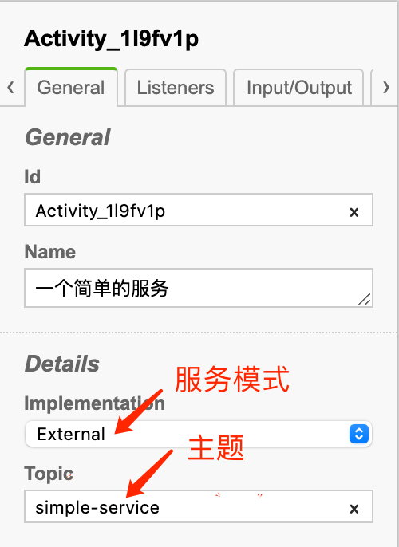

# 基本 BPMN 元素和建模方法

BPMN（Business Process Model and Notation，业务流程模型和注释）是流程建模的全球标准，是成功进行 Business-IT-Alignment（业务与 IT 一致性）的最重要组成部分之一。

BPMN 不是由某个企业主导的标准，而是由 [OMG](https://www.omg.org/) 制订的。OGM 制订了众多的国际标准，例如：UML。

Camunda BPM 实现了 BPMN 中的大部分建模方法。本文介绍基本的 BPMN 元素，及其在 Camunda BPM 中的使用方法。


## 基本的 BPMN 元素
| 名称                              |                             符号                             | 描述                                                         |
| --------------------------------- | :----------------------------------------------------------: | ------------------------------------------------------------ |
| None Start Event（空开始事件）    |  | 对**“无条件开始“**进行建模，通常一个流程都是从**”None Event“**开始的。 |
| Timer Start Event（定时开始事件） |  | **定时**启动流程。                                           |
| None End Event（空结束事件） |  | 对“无操作结束”进行建模，通常每个流程分支均应该结束于该事件。 |
| User Task（用户任务）    |  | 对由“人”完成的活动进行建模。         |
| Service Task（服务任务） |  | 对由“计算机设备”完成的活动进行建模。 |


## 空开始事件

所有的流程都从一个**开始事件**开始，**空开始事件**要求用户手动启动一个流程，可以通过 `POST /process-definition/key/{key}/start` 来启动一个流程实例。

> 启动流程实例 API 的完整参数参见：[Start Process Instance](https://docs.camunda.org/manual/latest/reference/rest/process-definition/post-start-process-instance/)


## 定时开始事件

定时启动某个流程也是非常常见的流程模型，例如：每个工作日早上 7:00 开始起床流程、每个月的最后一天开始工资发放流程等。**定时开始事件**对这类流程的启动进行建模。

定时开始事件使用了 Camunda BPM 内置的定时器任务（Timer Job）机制，该定时器支持三种定时方式：

- **日期（Date）**：在指定的时间，触发一次**计时事件（Timer Event）**
- **持续时间（Duration）**：即延时，延时一段时间后，触发一次计时事件
- **周期（Cycle）**：按照定义的时间间隔，反复触发计时事件。

> 定时事件使用了  **Job** 机制，因此需要开启 **Job 执行器（Job Executor）**。采用 Docker 部署 Camunda BPM Run 时，Job 执行器默认是开启的。如果采用其它部署方式，需要修改配置文件开启 Job 执行器。


### 时间格式

时间必须符合 [ISO 8601](https://baike.baidu.com/item/ISO%208601) 格式。例如：

- 时间点：2021-01-12T07:30:10、2021-01-12T15:30:10+08
- 时间段：P1Y3M5DT6H7M30S（1 年 3 个月 5 天 6 小时 7 分 30 秒）
- 周期：R3/PT10H（每 10 小时重复一次，总共重复 3 次）


### 时区

定时器的时间匹配的是**“Camunda BPM 服务器时间/时区”**。在开发时，并不能知晓服务器时区设置是否正确。因此，为了避免错误的，开发者应使用 UTC 时间（例如：2021-01-12T15:30:00Z）或者 UTC 相对偏移时间（例如：2021-01-12T15:30:00+08）。

> Docker 部署时，Docker 会自动将宿主机的时间/时区同步到容器内。但是，仍然推荐使用以上的规则，来避免错误。


### 示例

- 在 Modeler 中建立以下的模型：



- 按以下方式设置 Timer Start Event 控件的参数：


- 部署该流程后，无须做任何操作，当到达指定时间，该流程会自动启动一个实例。


## 空结束事件

**结束事件**标志一个流程的结束。**空结束事件**表示：直接结束流程，无须和其它流程交互。


## 用户任务

**用户任务**是对由人完成的活动进行建模。人通过应用系统与工作流引擎进行交互，完成：

- 用户任务的搜索
- 用户任务的认领
- 修改流程变量
- 用户任务的完成


### 任务分配

既然是由人完成的任务，首先要解决**“该任务由谁来完成”**。Camunda BPM 对 BPMN 的用户分配建模方法进行了扩展，引入了**执行人（Assignee）**、**候选人（Candiate Users）**、**候选组（Candiate Groups）**的概念。


#### 执行人（Assignee）

可以将用户任务直接分配给指定用户。


#### 候选人（Candiate Users）

可以设定允许执行该用户任务的多个用户，每个用户名之间用逗号隔开。可以同时设置候选人和候选组。


#### 候选组（Candiate Groups）

可以设定允许执行该用户任务的多个用户组，每个用户组名之间用逗号隔开。可以同时设置候选人和候选组。


> **注意：**在使用 Camunda Modeler 进行建模时，才可以直接设置以上属性。而使用其它建模软件时，则没有上述属性设置，只能通过修改 .bpmn 文件来设置这些属性。


#### 示例 - 静态分配用户任务




### 任务的动态分配

静态任务分配很多时候并不能满足业务逻辑要求。例如：

- 在设计流程时不知道执行人或候选人/组的确切名称
- 执行人不是一个确定值，而是取决于诸如“启动流程的人”之类的数据
- 任务分配逻辑可能很复杂，甚至需要访问外部数据源以实现查找，例如：“启动流程的员工的经理”

在 Node.js 开发中，可以使用过程变量来进行任务分配。


#### 示例 - 使用过程变量分配用户任务

建立以下的流程：



对 `usertask1` 做以下设置：



启动流程时，初始化 `starter` 流程变量，流程引擎会自动将 `usertask1` 分配给 “starter”。

```bash
curl -X POST -H "content-type: application/json" http://localhost:8080/engine-rest/process-definition/key/usertask-exp/start -d '{ "variables": { "starter": { "value": "kermit" } } }'
```

启动流程后，可以在 Cockpit 中进行观察：






> 在引用流程变量 `starter` 时，使用的语法是：`${starter}`。事实上，并不能直接将流程变量赋值给“执行人”，只能使用**表达式**。Camunda BPM 支持 EL（Unified Expression Language，统一表达语言）。EL 是 JSP 2.1 规范的一部分，可以参考[EL 官方文档](https://docs.oracle.com/javaee/5/tutorial/doc/bnahq.html)。


### 用户任务的搜索

使用 API：[`POST /task`](https://docs.camunda.org/manual/latest/reference/rest/task/post-query/) 可以根据**执行人**、**候选用户**、**候选组**、**流程变量**等等条件综合搜索与自己相关的任务列表。如果任务列表很长，需要分页，可以先使用 API：[`POST /task/count`](https://docs.camunda.org/manual/latest/reference/rest/task/post-query-count/) 获取列表的长度。


### 用户任务的认领

在建模时，如果仅指定了”候选人/候选组“，那么相关人员都可以搜索到该任务。但是，同一任务不应该由多个人员同时操作，这将导致不可控的操作结果。因此，在操作用户任务前（修改流程变量前），应先将该任务认领到自己的名下，即设定执行人为自己。使用以下 API 可以完成认领操作：

- [`POST /task/{id}/claim`](https://docs.camunda.org/manual/latest/reference/rest/task/post-claim/)
- [`POST /task/{id}/assignee`](https://docs.camunda.org/manual/latest/reference/rest/task/post-assignee/)

这两个认领操作的区别是：

- `claim` 将检查该任务是否已经分配了执行人。适用于对“任务池抢单”分配模式的建模。
-  `assignee` 不执行这一检查，直接认领任务。适用于“管理员指定”分配模式的建模。


#### 示例 - 使用 `claim` 认领任务

在**”示例 - 使用过程变量分配用户任务“**启动后，执行以下命令：

```bash
curl -i -X POST -H "content-type: application/json" http://localhost:8080/engine-rest/task/2b0cb01b-56f5-11eb-83d8-0242ac120002/claim -d '{ "userId": "aUserId" }'
```

由于任务已经分配给了 `kermit`，因此会得到以下的响应：

```bash
HTTP/1.1 500
Access-Control-Allow-Origin: *
Content-Type: application/json
Content-Length: 130
Date: Fri, 15 Jan 2021 05:56:29 GMT
Connection: close

{"type":"TaskAlreadyClaimedException","message":"Task '2b0cb01b-56f5-11eb-83d8-0242ac120002' is already claimed by someone else."}
```

返回码为 `500`，并指出“该任务已经被分配给其他人”，认领不成功。


#### 示例 - 使用 `assignee` 认领任务

接着执行以下命令：

```bash
curl -i -X POST -H "content-type: application/json" http://localhost:8080/engine-rest/task/2b0cb01b-56f5-11eb-83d8-0242ac120002/assignee -d '{ "userId": "aUserId" }'
```

强制认领任务后，得到以下响应：

```bash
HTTP/1.1 204
Access-Control-Allow-Origin: *
Date: Fri, 15 Jan 2021 06:04:38 GMT
```

返回码为 `204`，表示认领成功。


#### 取消认领

使用 API：[`POST /task/{id}/unclaim`](https://docs.camunda.org/manual/latest/reference/rest/task/post-unclaim/) 将任务的执行人清空。


### 流程变量的更新

使用 API：[`POST /task/{id}/variables`](https://docs.camunda.org/manual/latest/reference/rest/task/variables/post-modify-task-variables/) 可以添加、编辑、删除流程变量。

### 用户任务的结束

使用 API：[`POST /task/{id}/complete`](https://docs.camunda.org/manual/latest/reference/rest/task/post-complete/) 可以结束当前用户任务，并更新流程变量。


## 服务任务

**服务任务**是对由计算机系统完成的活动进行建模。

Camunda BPM 支持 5 种服务的实现方式，Node.js 开发中，使用 **外部任务（External Tasks）**模式来实现服务。外部任务在概念上与用户任务非常相似，作为普通开发者可以将其类比于用户任务来考虑：

- 用户任务由流程引擎创建，并添加到任务列表中；“人”查询任务列表，并声明该任务的执行人；完成任务后向流程引擎声明任务完成，流程引擎推动流程继续。
- 外部任务由流程引擎创建，并添加到**主题（Topic）**列表中；外部应用程序查询主题，并锁定该主题；完成任务后，外部应用程序向流程引擎声明任务完成，流程引擎推动流程继续。

> 外部任务采用了**长轮询（Long Polling）**的机制，来减少请求数量，提高服务器和客户端资源的利用效率。关于 Camunda BPM 实现外部服务的细节，可以参考[官方文档 - External Tasks](https://docs.camunda.org/manual/latest/user-guide/process-engine/external-tasks/)。


### 使用 Node.js 开发外部服务

对于 Node.js 开发者，Camunda BPM 官方提供了 SDK - [camunda-external-task-client](https://github.com/camunda/camunda-external-task-client-js)，封装了实现外部服务的 API，简化了外部服务的开发工作。


### 示例 - 使用 Node.js 开发外部服务

建立以下的流程：



设置服务任务属性：



安装 Camunda External Task Client JS library：

```bash
npm install camunda-external-task-client-js -S
```

外部服务代码：

```javascript

```


### 一个简单的 BPMN 流程图 - 发货流程

下图是一个电商的发货流程：


在此示例中，使用了**泳池（Pool）**和**泳道（Lane）**来对参与此流程的人员进行建模。工作流引擎将驱动该流程，分配用户任务，并负责人员之间（用户任务之间）的通信。开发者只需处理用户任务，而无需关注用户间的通信和流程的推进。


### 另一个简单的 BPMN 流程图 - 披萨协作

下面的示例中，我们对“点披萨的客户”和“披萨店”之间的交互进行显示建模。“客户”和“披萨店”被称之为**“参与者”**，各自拥有自己的泳池。

