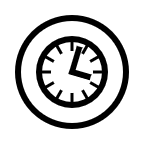
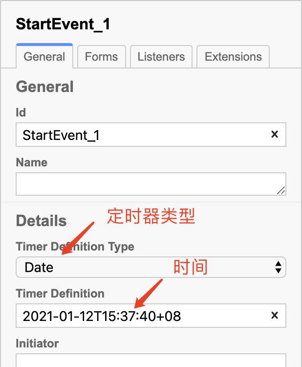

# 基本 BPMN 元素和建模方法

BPMN（Business Process Model and Notation，业务流程模型和注释）是流程建模的全球标准，是成功进行 Business-IT-Alignment（业务与 IT 一致性）的最重要组成部分之一。

BPMN 不是由某个企业主导的标准，而是由 [OMG](https://www.omg.org/) 制订的。OGM 制订了众多的国际标准，例如：UML。

Camunda BPM 实现了 BPMN 中的大部分建模方法。本文介绍基本的 BPMN 元素，及其在 Camunda BPM 中的使用方法。

## 开始事件（Start Event）

“开始事件”是对一个流程如何开始进行建模，基本的开始事件包括：

| 名称                  |                             符号                             | 描述                                                         |
| --------------------- | :----------------------------------------------------------: | ------------------------------------------------------------ |
| None（空开始事件）    |  | 对**“无条件开始“**进行建模，通常一个流程都是从**”None Event“**开始的。 |
| Timer（定时开始事件） |  | **定时**启动流程。                                           |

### 空开始事件

所有的流程都从一个“开始事件”开始，“空开始事件”要求用户手动启动一个流程，可以通过 `POST /process-definition/key/{key}/start` 来启动一个流程实例。

> 启动流程实例 API 的完整参数参见：[Start Process Instance](https://docs.camunda.org/manual/latest/reference/rest/process-definition/post-start-process-instance/)

### 定时开始事件

定时启动某个流程也是非常常见的流程模型，例如：每个工作日早上 7:00 开始起床流程、每个月的最后一天开始工资发放流程等。定时开始事件对这类流程的启动进行建模。

定时开始事件使用了 Camunda BPM 内置的定时器任务（Timer Job）机制，该定时器支持三种定时方式：

- **日期（Date）**：在指定的时间，触发一次**计时事件（Timer Event）**
- **持续时间（Duration）**：即延时，延时一段时间后，触发一次计时事件
- **周期（Cycle）**：按照定义的时间间隔，反复触发计时事件。

> 定时事件使用了  **Job** 机制，因此需要开启 **Job 执行器（Job Executor）**。采用 Docker 部署 Camunda BPM Run 时，Job 执行器默认是开启的。如果采用其它部署方式，需要修改配置文件开启 Job 执行器。

#### 时间格式

时间必须符合 [ISO 8601](https://baike.baidu.com/item/ISO%208601) 格式。例如：

- 时间点：2021-01-12T07:30:10、2021-01-12T15:30:10+08
- 时间段：P1Y3M5DT6H7M30S（1 年 3 个月 5 天 6 小时 7 分 30 秒）
- 周期：R3/PT10H（每 10 小时重复一次，总共重复 3 次）

#### 时区

定时器的时间匹配的是**“Camunda BPM 服务器时间/时区”**。在开发时，并不能知晓服务器时区设置是否正确。因此，为了避免错误的，开发者应使用 UTC 时间（例如：2021-01-12T15:30:00Z）或者 UTC 相对偏移时间（例如：2021-01-12T15:30:00+08）。

> Docker 部署时，Docker 会自动将宿主机的时间/时区同步到容器内。但是，仍然推荐使用以上的规则，来避免错误。

#### 例子

- 在 Modeler 中建立以下的模型：

- 按以下方式设置 Timer Start Event 控件的参数：

- 部署该流程后，无须做任何操作，当到达指定时间，该流程会自动启动一个实例。

## 结束事件

“结束事件”标志一个流程的结束。基本的结束事件包括：

| 名称               |                             符号                             | 描述                                                         |
| ------------------ | :----------------------------------------------------------: | ------------------------------------------------------------ |
| None（空结束事件） |  | 对“无操作结束”进行建模，通常每个流程分支均应该结束于该事件。 |

## 泳池和泳道

### 一个简单的 BPMN 流程图 - 发货流程

下图是一个电商的发货流程：

在此示例中，使用了**泳池（Pool）**和**泳道（Lane）**来对参与此流程的人员进行建模。工作流引擎将驱动该流程，分配用户任务，并负责人员之间（用户任务之间）的通信。开发者只需处理用户任务，而无需关注用户间的通信和流程的推进。

### 另一个简单的 BPMN 流程图 - 披萨协作

下面的示例中，我们对“点披萨的客户”和“披萨店”之间的交互进行显示建模。“客户”和“披萨店”被称之为**“参与者”**，各自拥有自己的泳池。

