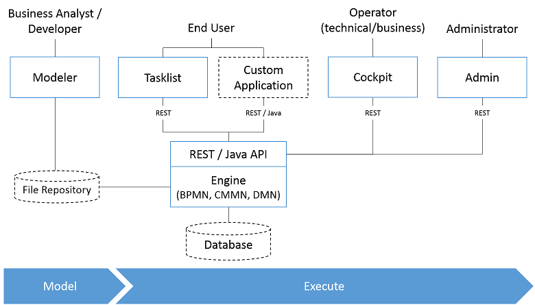
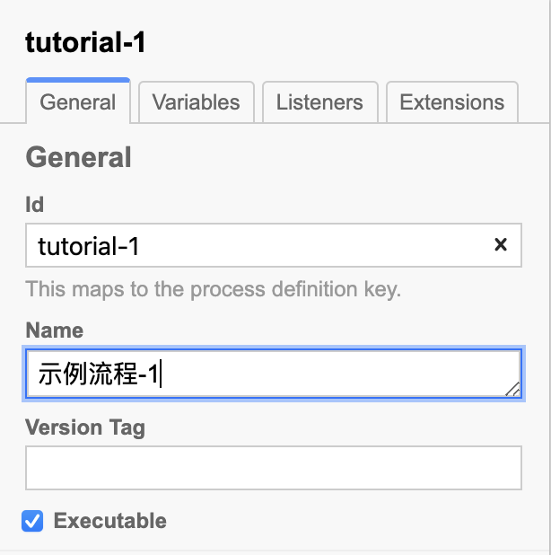
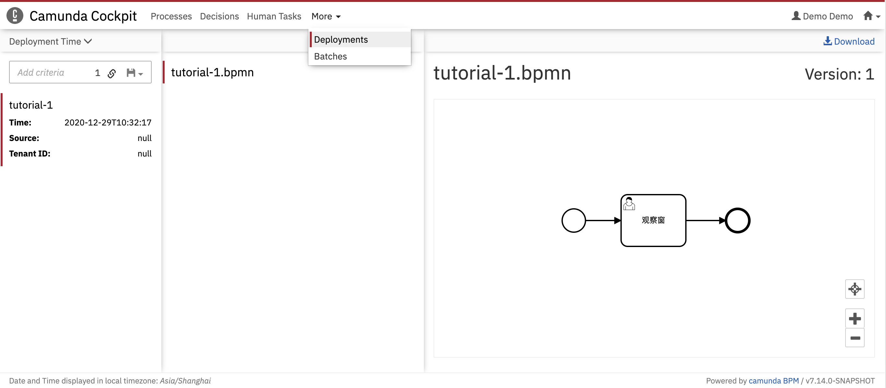
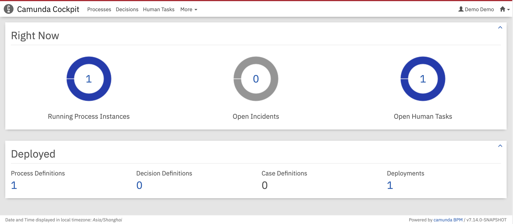

# Camunda BPM 的 Node.js 开发快速指南

## Camunda BPM 官方文档

- [Get Started](https://docs.camunda.org/get-started/)
- [REST API Reference](https://docs.camunda.org/manual/7.14/reference/rest/)
- [BPMN 2.0 Tutorial](https://camunda.com/bpmn/)
- [BPMN 2.0 Reference](https://docs.camunda.org/manual/7.14/reference/bpmn20/)
- [User Guide](https://docs.camunda.org/manual/7.14/user-guide/)


## Camunda BPM 概述

Camunda 基于 Java 的 BPM 框架，支持 BPMN（工作流/过程自动化）、CMMN（事件管理）和 DMN（业务决策管理）等标准。

下图展示了 Camunda 中最重要的组件，以及典型的用户角色。




### 工作流/过程引擎（Process Engine）

- 过程引擎是一个 Java Library，用于执行 BPMN 2.0 过程、CMMN 1.1 事件和 DMN 1.3 决策表。它使用了关系数据库来做数据持久化。


### 建模器（Modeler）

- Camunda 提供了**建模器**，用于 BPMN 2.0、CMMN 1.1 的流程图建模，以及 DMN 1.3 的决策表建模。

- 也可以使用**在线的建模器**：[bpmn.io](https://bpmn.io) 来完成建模。


### Web 应用

- **REST API** 允许 Javascript 应用使用**过程引擎**，这是 Node.js 开发者使用 Camunda BPM 的方式。
- **Camunda Tasklist** 是基于 Web 的任务管理应用，它允许用户查看工作流任务，修改任务数据。
- **Camunda Cockpit** 是基于 Web 的工作流实例管理应用，它允许用户监控工作流实例，探查工作流实例的状态，修正被中断的工作流。
- **Camunda Admin** 是用户管理、组管理和授权的 Web 应用。


## Camunda BPM 平台的 Node.js 开发架构

### 独立的过程引擎服务器（Standalone/Remote Process Engine Server）


**过程引擎**作为一个独立的服务器运行，提供网络服务。远程应用（Node.js 应用）通过 REST API 和过程引擎进行交互。


### 集群模式（Clustering Model）

**过程引擎**也支持集群部署，每个**过程引擎**实例必须连接到同一个共享的数据库。


## Camunda BPM 的部署

### Camunda BPM 的发布

- **Full Distribution** 是以 **WAR** 形式发布的版本，它需要运行在 Java 应用服务器上，例如：Wildfly 或者 Tomcat。部署 **Full Distribution** 需要一定的 Java 开发基础，对 Node.js 开发者不友好。
- **Camunda BPM Run** 是预先打包好的 spring boot 应用，包括：Camunda BPM Platform 和 REST API，无需任何 Java 开发知识，就可以部署。


### Docker 部署

**Camunda BPM Run** 的部署固然不需要 Java Application Server，但是仍然离不开 Java 环境：运行 Camunda BPM Run 需要 **Java Runtime Environment 8+**。

采用 Docker 部署可以进一步简化部署过程：Camunda 已经预先将运行环境和 Camunda BPM Run 打包成 Docker 镜像，发布在 [hub.docker.com](https://hub.docker.com/r/camunda/camunda-bpm-platform) 上，只需要运行以下命令，就可以方便的部署最新的 Camunda BPM Run。

```bash
docker pull camunda/camunda-bpm-platform:run-latest
docker run -d --name camunda -p 8080:8080 camunda/camunda-platform:run-latest
```

部署成功后，可以通过：

- http://localhost:8080/camunda/app/ 来访问 Camunda webapps（Cockpit，Tasklist，Admin）
- http://localhost:8080/engine-rest/ 来访问 REST API

- 默认的用户名/密码：demo/demo


## Camunda BPM Run 的配置

Camunda BPM Run 是 Spring Boot 应用，因此需要少许 Spring Boot 应用配置的知识：

- Spring Boot 可以通过配置文件来进行配置，Camunda BPM Run 的配置文件位于：`configuration/`
- Camunda BPM Run 提供了两个配置文件：`default.yml` 和 `production.yml` 分别用于开发和生产环境
  - 不带任何参数启动，使用 `default.yml`
  - 使用参数 `--production` 启动，使用 `production.yml`
- 可以使用环境变量来覆盖配置文件中的配置项
  - Docker 部署时，使用环境变量来进行配置，是比较方便的方式
  - 使用环境变量参数使得 `docker run` 命令很长，使用 `docker-compose` 进行部署，更为方便


### 配置数据库

Camunda BPM Run 默认连接到 H2 内存数据库，需要连接到一个独立的数据库来实现数据持久化。

#### 数据库的选择

Camunda BPM Run 支持主流的数据库，并内置了 MySQL 和 PostgreSQL 的 JDBC 驱动。

Camunda 官方文档公布支持的数据库：

- MySQL 5.6 / 5.7
- PostgreSQL 9.4 / 9.6 / 10.4 / 10.7 / 11.1 / 11.2 / 12.2

通常认为：

- PostgreSQL 在可靠性和数据完整性上优于 MySQL
- MySQL 被 Orcale 收购后，遭到很多去 Orcale 化开发者的弃用
- 与 PostgreSQL 12 相比，MySQL 5 过于陈旧，而 Camunda 官方并没有宣称支持 MySQL 8

因此，采用 PostgreSQL 12.2 来做数据持久化。


#### 数据库的部署

同样采用 `docker-compose` 部署 PostgreSQL 12.2 最为方便。

`docker-compose.yaml`：

```yaml
version: "3.8"
services:
	camunda-db:
		image: postgres:12.2
		container_name: camunda-db
		environment:
			- POSTGRES_PASSWORD=camunda
      - POSTGRES_USER=camunda
      - POSTGRES_DB=camunda
    expose:
      - 5432
    volumes:
      - camunda_pgdata:/var/lib/postgresql/data
    command: postgres

volumes:
	camunda_pgdata:
```


#### 连接数据库

连接数据库需要设置以下属性：

| 前缀              | 属性名             | 描述                                                         |
| ----------------- | ------------------ | ------------------------------------------------------------ |
| spring.datasource | .url               | 数据库的 JDBC 连接路径                                       |
|                   | .driver-class-name | 数据库 JDBC 驱动的类名。需要将 JDBC 驱动存储到 `configuration/userlib` 目录下。Camunda BPM Run 发行版已经内置了 MySQL 和 PostgreSQL 的 JDBC 驱动 |
|                   | .username          | 数据库连接的用户名                                           |
|                   | .password          | 数据库连接的用户密码                                         |

如果采用上一节的参数部署 PostgreSQL，则对应的 Camunda BPM Run 的数据库配置（`docker-compose.yaml`）为：

```yaml
...
		environment:
      - SPRING_DATASOURCE_DRIVER_CLASS_NAME=org.postgresql.Driver
      - SPRING_DATASOURCE_URL=jdbc:postgresql://camunda-db:5432/camunda
      - SPRING_DATASOURCE_USERNAME=camunda
      - SPRING_DATASOURCE_PASSWORD=camunda
```

> 在使用环境变量设置 Spring Boot 应用时：
>
> - 属性的连接符使用 "`_`" 来取代 "`.`"
> - 属性的所有字母均需要大写


### 配置跨域

由于使用 Docker 部署独立服务器，且采用了 REST API 远程调用的开发架构，因此 Camunda BPM Run 服务器必须允许跨域的资源访问。

配置跨域的属性为：

| 前缀                 | 属性名           | 描述                                       | 默认值                   |
| -------------------- | ---------------- | ------------------------------------------ | ------------------------ |
| camunda.bpm.run.cors | .enabled         | 是否允许跨域                               | false                    |
|                      | .allowed-origins | 允许跨域访问的来源列表，用逗号隔开多个来源 | 所有来源，包括 `file://` |

为了确保打开跨域，可以添加以下环境变量到 `docker-compose.yaml`：

```yaml
...
		environment:
			...
			- CAMUNDA_BPM_RUN_CORS_ENABLED=true
```


### 完整的 `docker-compose.yaml` 示例

```yaml
version: "3.8"
services:
  camunda-bpm:
    image: camunda/camunda-bpm-platform:run-latest
    container_name: camunda-bpm
    restart: unless-stopped
    depends_on:
      - camunda-db
    environment:
      - SPRING_DATASOURCE_DRIVER_CLASS_NAME=org.postgresql.Driver
      - SPRING_DATASOURCE_URL=jdbc:postgresql://camunda-db:5432/camunda
      - SPRING_DATASOURCE_USERNAME=camunda
      - SPRING_DATASOURCE_PASSWORD=camunda
      - CAMUNDA_BPM_RUN_CORS_ENABLED=true
    expose:
      - 8080
    ports:
    	- 8080:8080

  camunda-db:
    image: postgres:12
    container_name: camunda-db
    restart: unless-stopped
    environment:
      - POSTGRES_PASSWORD=camunda
      - POSTGRES_USER=camunda
      - POSTGRES_DB=camunda
    expose:
      - 5432
    volumes:
      - camunda_pgdata:/var/lib/postgresql/data
    command: postgres
    
volumes:
  camunda_pgdata:
```


启动命令：

```bash
docker-compose up -d
```


## 工作流引擎的基本概念

流程定义（Process Definition）：用于描述和定义业务逻辑，是流程的一种建模方法。

流程实例（Process Instance）：代表流程定义的执行实例，包括了所有的运行节点。

执行（Execution）：描述流程执行中的每一个节点。

流程变量（Process Variables）：与流程实例相关的数据，可以用于处理流程实例运行时的状态，例如：控制流程的分支、指定活动的执行人等。


## 流程定义

Camunda BPM 支持 BPMN 2.0 和 CMMN 1.1 流程建模，通常我们使用 BPMN 2.0 规范。

BPMN 2.0 规范使用了 XML 语言来进行建模。为了简化建模，通常使用图形化的建模器。Camunda BPM 提供了 **Modeler** 应用程序来支持流程建模。**Modeler** 会自动检查建模的错误（大多是某些关键属性没有正确设置），并在 **Log** 窗口进行提示。


### BPMN 的基本元素和建模方法

常用的 BPMN 元素包括：Events、Tasks、Gateways。

BPMN 流程总是开始于**“开始事件（Start Event）”**，运行一些**“任务（Task）”**，根据条件（流程变量）使用**“网关（Gateway）“**来控制下一步执行什么任务，最后结束于**”结束事件（End Event）“**。


详细的建模方法，后续章节再描述。


### 流程定义的关键属性

流程定义有两个必须要设置的关键属性：

- `Id`：必须保证全局唯一。在使用 Modeler 进行建模时，会自动生成一个唯一的 `Id`，可以手动修改。
- `Name`：建议起一个有意义的名字（可以是中文）以便于记忆，并保持全局唯一。
- 需要通过 `Id` 来启动一个流程实例，因此最好设定 `Id`，并起一个有意义的标识符。




### 流程定义的部署

- 开发时，Camunda BPM 可以通过 REST API 来部署流程定义，也可以使用 **Modeler** 来进行部署（本质上，也是 REST API 部署）。

- 对于生产版本，Camunda BPM 还提供了自动部署方式：将待部署的流程定义拷贝到 `configuration/resources/` 目录下，在启动 Camunda BPM Run 时，将自动部署这些流程定义。

- Camunda BPM 支持流程定义版本：同一个名字的流程可以拥有多个版本。执行中的流程实例，可以迁移到新版本；也可以在老版本中运行，直到结束。


### 流程定义部署示例

#### 创建示例流程定义

建立一个简单的流程定义：`tutorial-1.bpmn`。

这个流程包括三个元素：

- 开始事件
- 名为：“观察窗”的用户任务
- 结束事件


#### 使用 REST API 部署 `tutorial-1` 流程定义

Camunda BPM 中引入了**“部署”（Deployment）**的概念，即每次部署流程定义的操作称为一次“部署”。

- 一次“部署”可以部署多个流程定义
- 删除一次“部署”可以一次性删除多个流程定义

使用 `/deployment/create` 命令将执行部署流程定义。


##### Method

POST /deployment/create


##### Common Parameters

| Form Part Name  | Content Type              | Description                                          |
| --------------- | ------------------------- | ---------------------------------------------------- |
| deployment-name | text/plain                | 本次部署的名字，后续可以用这个名字查询、管理这个部署 |
| *               | application/octect-stream | 上传的流程定义文件数据流                             |


##### Response Codes

| Code | Media Type       | Description                  |
| ---- | ---------------- | ---------------------------- |
| 200  | application/json | 部署成功                     |
| 400  | application/json | 部署失败，不能解析 BPMN 文件 |


##### Examples

```bash
$ curl -v -F "deployment-name=tutorial" -F bpmn=@tutorial-1.bpmn http://localhost:8080/engine-rest/deployment/create
{
	"links": [{
		"method": "GET",
		"href": "http://localhost:8080/engine-rest/deployment/15f3facb-48ea-11eb-8760-0242ac120003",
		"rel": "self"
	}],
	"id": "15f3facb-48ea-11eb-8760-0242ac120003",
	"name": "tutorial",
	"source": null,
	"deploymentTime": "2020-12-28T08:52:59.279+0000",
	"tenantId": null,
	"deployedProcessDefinitions": {
		"tutorial-1:1:15fc382d-48ea-11eb-8760-0242ac120003": {
			"id": "tutorial-1:1:15fc382d-48ea-11eb-8760-0242ac120003",
			"key": "tutorial-1",
			"category": "http://bpmn.io/schema/bpmn",
			"description": null,
			"name": "示例流程-1",
			"version": 1,
			"resource": "tutorial-1.bpmn",
			"deploymentId": "15f3facb-48ea-11eb-8760-0242ac120003",
			"diagram": null,
			"suspended": false,
			"tenantId": null,
			"versionTag": null,
			"historyTimeToLive": null,
			"startableInTasklist": true
		}
	},
	"deployedCaseDefinitions": null,
	"deployedDecisionDefinitions": null,
	"deployedDecisionRequirementsDefinitions": null
}
```


### 使用 Cockpit 查看/管理流程定义


点击流程定义的名字，可以查看流程定义的详情。后续的很多调试工作，也需要在详情页面进行。


### 使用 Cockpit 查看/管理部署




## 流程变量

### 变量的作用域（Scopes）

- 流程变量分为：实例变量（Process Variables）和本地变量（Local Variables）。

- 实例变量的作用域是整个流程实例；本地变量的作用域是某个执行（Execution）或者任务（Task）。

- 本地变量将屏蔽实例变量。


### 变量定义

Camunda BPM 采用了**类型-值（Typed-Value）**方法来定义变量。在 REST API 调用中，变量形式为：

```json
variableName: {
  value: variableValue,
  type: variableType,
  valueInfo: additionalProperties
}
```


### 变量类型


- Camunda BPM 是 Java 应用，因此支持 9 种 Java 的基本类型。

> **注意：**在 REST API 中，变量类型需要首字母大写，例如：`Boolean`

- Camunda BPM 内置了 `File` 类型，可以用于存储文件。
- 支持**自定义对象类型**。需要通过 Java Class 来支持**自定义对象类型**，因此在 Node.js 开发中，不能使用这种数据类型。

- Java 不支持 json 和 xml 数据类型，只能通过**自定义对象类型**来处理它们。Camunda BPM 已为这两种类型内置了对应的 Java Class，因此可以将这两种类型视为内置类型。
- 通常情况下，无需指定数据类型（不需要对 `type` 进行赋值），Camunda BPM 会自动推断数据类型。
  - Javascript 中 date 不是基本的数据类型，而是一个对象，因此 Camunda BPM 不能正确推断该类型。可以用以下的程序片段来处理 `Date` 数据。

```javascript
const moment = require("moment");

/**
 * 将 JSON 格式数据转换成 Value_Type 格式数据
 *
 * @param {Object} json - JSON 格式数据
 * @returns {Object} - Value_Type 格式数据
 */
const jsonToTypeValue = json => {
  let res = {};

  for (const key in json) {
    switch (Object.prototype.toString.call(json[key])) {
      case "[object Date]":
        // 是 Date
        res[key] = {
          type: "Date",
          value: moment(json[key])
            .format("YYYY-MM-DDTHH:mm:ss.SSSZZ")
            .toString()
        };
        break;
      default:
        // 其它类型，Camunda 会自动推断类型，指定
        res[key] = { value: json[key] };
        break;
    }
  }

  return res;
};

/**
 * 将 Value_Type 格式数据转换成 JSON 格式数据
 *
 * @param {Object} typeValue - Value_Type 格式数据
 * @returns {Object} - JSON 格式数据
 */
const typeValueToJson = typeValue => {
  let res = {};

  for (const key in typeValue) {
    switch (typeValue[key].type) {
      case "Date":
        res[key] = moment(typeValue[key].value).toDate();
        break;
      default:
        // 其它类型，直接转换为 Javascript 类型
        res[key] = typeValue[key].value;
        break;
    }
  }

  return res;
};
```

> 实际上，`Json` 类型在 Camunda BPM 中的处理比较复杂。
>
> - Camunda BPM 使用**序列化格式**（Serialization Format）来处理**自定义对象类型**。当我们指定 `Json` 类型时，Camunda BPM 内置的 **Json Spin** 期望传递一个字符串值，而不是一个 JSON 对象。因此，我们需要用以下的程序片段来使用 `Json` 类型：
>
> ```javascript
>     switch (Object.prototype.toString.call(json[key])) {
>       case "[object Object]":
>         // 是 JSON
>         res[key] = {
>           type: "Json",
>           value: JSON.stringify(json[key])
>         };
>         break;
>       default:
>         // 其它类型，Camunda 会自动推断类型，指定
>         res[key] = { value: json[key] };
>         break;
>     }
> ```
>
> - Node.js 开发中，也可以不用序列化格式来处理 JSON。无需指定 `type`，让 Camunda BPM 自行推断类型，也可以正确处理 JSON 类型！


## 流程实例

### 启动一个流程实例

可以通过流程定义的 `id` 或 `key` 来启动一个流程实例。通常，使用 `key` 来指定流程定义更为方便。

> - 这里的 `id` 是部署时返回的流程定义部署 `id`，可以通过部署查询命令来查询。
> - 这里的 `key` 就是流程定义建模时设定的 `Id`，如“流程定义”一节所述，最好给流程定义设定一个有明确意义的 `Id`，以方便记忆。
> - 使用 `key` 启动流程定义的最新版本实例。
> - 如果要启动流程定义的旧版本实例，只能使用 `id` 的方式来启动


#### Method

POST /process-definition/key/{key}/start


#### Common Paraments

##### Path Paraments

| Name | Description     |
| ---- | --------------- |
| key  | 流程定义的 `Id` |


##### Request Body

| Name      | Description                                                  |
| --------- | ------------------------------------------------------------ |
| variables | JSON 数据对象。在初始化流程的时候，可以同时初始化流程变量。JSON 中的每个键对应了一个流程变量。 |


#### Key Result

| Name | Value  | Description                                             |
| ---- | ------ | ------------------------------------------------------- |
| id   | String | 流程实例的 `id`，全局唯一，通过该 `id` 来引用流程实例。 |


#### Example

- 使用 `curl` 启动一个流程实例，并添加一个流程变量 `info`。

```bash
$ curl -X POST -H "content-type: application/json" http://localhost:8080/engine-rest/process-definition/key/tutorial-1/start -d '{ "variables": { "info": { "value": "第一个示例流程实例。" } } }'
{
  "links": [
    {
      "method": "GET",
      "href": "http://localhost:8080/engine-rest/process-instance/30fa4a08-4981-11eb-9728-0242ac120002",
      "rel": "self"
    }
  ],
  "id": "30fa4a08-4981-11eb-9728-0242ac120002",
  "definitionId": "tutorial-1:1:11d23e49-497e-11eb-9728-0242ac120002",
  "businessKey": null,
  "caseInstanceId": null,
  "ended": false,
  "suspended": false,
  "tenantId": null
}
```

- 使用 Node.js 启动一个流程实例

```javascript
const axios = require("axios");
const bpmClient = axios.create({
  baseURL: "http://localhost:8080/engine-rest",
  headers: { "Content-Type": "application/json" }
});

const processDefinitionKey = "tutorial-1";

const opt = {
  method: "post",
  url: `/process-definition/key/${processDefinitionKey}/start`,
  data: {
    variables: {
      info: {
        value: "第一个示例流程实例。"
      }
    }
  }
};

bpmClient
  .request(opt)
  .then(res => {
    console.log(res);
  })
  .catch(err => {
    console.log(err.message);
  });
```

> 后面的例子中，如无必要，将只给出常数 `opt` 的定义。


### 使用 Cockpit 查看/管理流程实例

- Cockpit 首页可以查看有多少个正在运行的流程实例。



- Cockpit 流程定义页面可以查看每个流程定义开启了多少个流程实例。


- 点击流程定义名字，可以查看流程实例列表。


- 点击流程实例 id，可以查看流程实例详情。


### 流程实例的运行和结束

- 流程实例由一系列**任务（Task）**组成。当一个**任务**完成时，会根据流程设计自动流转到下一个任务。
- 任务分为两大类：**用户任务（User Task）**和其它。
  - 其它任务在结束时，会自动完成当前任务，工作流引擎推动流程流转到下一个任务。
  - **用户任务**必须调用**任务结束 API**，来通知工作流引擎当前任务已结束，并流转到下一个任务。
- 当所有的任务都完成时，整个流程实例将结束，工作流引擎会将其保存到 `history` 中。可以通过 `hisotry` REST API 来查询历史实例。 


### 用户任务的交互模型

**用户任务（User Task）**是需要“人”参与的任务，“人（用户）”通过 UI 界面与工作流引擎进行交互。基本的交互模型如下：


### 用户任务的执行人（assignee）和候选组（candidateGroup）

**用户任务**必须指定“执行人”。指定执行人的方法包括：

- 在建模时指定，适用于静态分配的情况，例如：所有的合同审批必须由总经理签字，那么这一环节的执行人，在设计时就可以确定（当然，这个案例更好的设计方法是使用“候选组”进行建模，稍后再进行讨论）。静态指定执行人的方案非常不灵活，用得很少。
- 使用 `POST /task/{id}/assigne` 或 `POST /task/{id}/claim` 命令来指定执行人。`assignee` 不检查任务是否已经被分配；而 `claim` 将检查任务是否已经被分配。这种方案是由用户来指定执行人，通常用于“任务池领取任务”、“管理员分配任务”等业务场景。
- 通过流程变量来指定执行人：在建模时，可以让“执行人”=“某个流程变量”，或者“执行人”=“某个简单的表达式”。这样就可以通过流程变量来动态指定执行人。通常这种情况下，用户任务前面会有一个 DMN 决策表，或 Service Task，它们通过预先指定的规则，计算出某个流程变量，这样在进入用户任务时，就能自动地、动态地指定执行人。这就实现了“按规则分配任务”的业务场景。
- 建模时，可以指定候选组，即：哪个或哪几个用户组，可以执行该任务。候选组不能取代执行人，在流程实例中，任务最终还是要分配给某个执行人。例如：
  - 合同审批必须总经理签字，但是设计时并不知道总经理的 userId。那么，可以指定 `GM` 为该任务的候选组，这样的设计更通用。
  - “任务池领取任务”业务场景，建模时也应该使用候选组。只要属于候选组的用户，均可以搜索到该任务，然后通过 `claim` 命令，把该任务领取到自己的 userId 下。


### 搜索用户任务

Camunda BPM 提供了非常强大的搜索功能，可以通过以下的条件进行搜索：

- 任务的责任人（Assignee）
- 任务的用户组
- 任务的 id / name
- 关联的流程实例 id
- 关联的流程定义 id / name
- 流程变量


#### Method

POST /task


#### Common Parameters

| Name                      | Description                                                  |
| ------------------------- | ------------------------------------------------------------ |
| processInstanceId         | 在指定 id 的流程实例中搜索                                   |
| processInstanceIdIn       | 在指定 id 数组的一组流程实例中搜索                           |
| processDefinitionKey      | 在指定 key 的流程定义中搜索                                  |
| processDefinitionKeyIn    | 在一组流程定义中搜索                                         |
| processDefinitionName     | 在指定 name 的流程定义中搜索                                 |
| processDefinitionNameLike | 模糊匹配流程定义 name                                        |
| assignee                  | 执行人匹配                                                   |
| assigneeLike              | 模糊匹配执行人                                               |
| assigneeIn                | 在一组执行人中匹配                                           |
| candidateGroup            | 匹配用户组                                                   |
| candidateGroups           | 匹配一组用户组                                               |
| assigned                  | 搜索已分配的任务                                             |
| unassigned                | 搜索未分配的任务                                             |
| taskDefinitionKey         | 匹配任务 key                                                 |
| taskDefinitionKeyIn       | 匹配一组任务 key                                             |
| taskDefinitionKeyLike     | 模糊匹配任务 key                                             |
| name                      | 匹配任务名称                                                 |
| nameLike                  | 模糊匹配任务名称                                             |
| processVariables          | 匹配流程变量，支持逻辑操作，例如：eq、neq、gt、gteq、lt、lteq。多个条件之间是逻辑与关系 |
| taskVariables             | 匹配任务变量                                                 |
| orQueries                 | 逻辑或关系查询条件                                           |
| sorting                   | 结果排序                                                     |


#### Result

符合条件的 task 数组。


> 任务搜索支持分页。在分页前，可以使用 `POST /task/count` 命令来获取符合条件的任务数。


### 使用 Cockpit 观察用户任务状态

- 点击**用户任务**，可以查看任务详情。
  - 有一个“观察窗任务”在等待用户交互
  - 没有给**用户任务**添加 Local Variables，但是 Instance Variables 在用户任务中是可以访问的


- 可以查看/管理**用户任务**的**责任人（Assignee）**


> **Tips：**用户任务会中断流程实例的运行，等待人机交互。此时，可以通过 Cockpit 观察所有的流程变量。因此，调试时可以在需要的地方插入用户任务，就如同插入断点一样，可以在插入处观察流程变量的值，达到调试流程的目的。


### 修改流程变量

#### Method

POST /task/{id}/variables


#### Common Parameters

##### Path Parameters

| Name | Description |
| ---- | ----------- |
| id   | 任务 id     |


##### Request Body

| Name          | Description                        |
| ------------- | ---------------------------------- |
| modifications | JSON对象。要修改或添加的流程变量。 |
| deletions     | String 数组。要删除的流程变量。    |


### 结束一个用户任务

#### Method

POST /task/{id}/complete


#### Common Parameters

##### Path Parameters

| Name | Description |
| ---- | ----------- |
| id   | 任务 id     |


##### Request Body

| Name      | Description                |
| --------- | -------------------------- |
| variables | 在任务结束时，设置流程变量 |


## 关于流程变量的进阶讨论

### JSON 类型的流程变量

可以使用两种方式添加/修改 JSON 类型的流程变量：使用/不是 Camunda Spin plugin

```javascript
const Json = {
  aString: "这是一个字符串",
  aNumber: 100,
  aBoolean: true
};

const taskId = "42f4d5d5-4982-11eb-9728-0242ac120002"; // 请根据实际情况修改taskId
const opt = {
  method: "post",
  url: `/task/${taskId}/variables`,
  data: {
    modifications: {
      aJson: {
        value: JSON.stringify(Json),
        type: "Json"
      },
      anotherJson: {
        value: Json
      }
    }
  }
};
```

在 Cockpit 中观察两种方式添加的 JSON 变量，可以看到：

- 指定 `Json` 类型，被 Camunda 识别为 `Json`，并以 JSON 的形式显示。
- 没有指定 `Json` 类型，被 Camunda 自动推断为 `LinkedHashMap` 类型。


点击 `java.util.LinkedHashMap` 可以显示变量的内容：**“Serialized”** 格式的内容是真正存储在数据库中的内容，是无法直接阅读的；**"Deserialized"** 格式的内容是通过 Camunda 中对应的 "Serializer" 解码后的内容，是可以阅读的。


> Node.js 应用中暂时没发现这两种方式有什么区别。


### Array 类型的变量

可以直接添加/修改 Array 类型变量，无需指定类型，让 Camunda 自行推断就好。Camunda 中会将 Array 映射成 `java.util.ArrayList` 对象进行 **"Serialized"** 存储。

```javascript
const array = [1, 1, 2, 3, 5, "斐波那契数列"];

const taskId = "42f4d5d5-4982-11eb-9728-0242ac120002"; // 请根据实际情况修改taskId
const opt = {
  method: "post",
  url: `/task/${taskId}/variables`,
  data: {
    modifications: {
      aArray: {
        value: array
      }
    }
  }
};
```


### File 类型的变量

Camunda 提供了文件上传、下载的能力。

#### 上传一个文件

上传一个文件，就是添加一个文件类型的变量，该变量需要设定以下内容：

| Name      | Field    | Description                                                  |
| --------- | -------- | ------------------------------------------------------------ |
| value     |          | String 类型，将文件内容（Binary）进行 Base64 编码。注意：如果上传的是图片文件，不能添加诸如 `data:img/jpg;base64,` 的头部，而是直接将文件进行 Base64 编码。 |
| type      |          | `"File"`                                                     |
| valueInfo |          | 需要设定三个字段                                             |
|           | filename | 下载时使用的文件名，不是变量名。不能使用中文，Camunda 尚不能正确处理中文文件名。 |
|           | mimetype | 文件的 MIME 类型。HTTP 标准中规定的媒体类型，例如：`text/plain`、`img/jpg` 等。 |
|           | encoding | 文本文件的编码类型，例如："UTF-8"。                          |

##### Example

```javascript
const text = "5paH5pys5paH5Lu256S65L6L44CC"; // "文本文件示例。"的 Base64 编码
const taskId = "42f4d5d5-4982-11eb-9728-0242ac120002"; // 请根据实际情况修改taskId
const opt = {
  method: "post",
  url: `/task/${taskId}/variables`,
  data: {
    modifications: {
      aFile: {
        value: text,
        type: "File",
        valueInfo: {
          filename: "textFile.txt",
          mimetype: "text/plain",
          encoding: "UTF-8"
        }
      }
    }
  }
};
```


#### 下载一个文件

Camunda 中，文件变量会以文件的形式存储在服务器上，可以直接下载，下载地址为：`GET /task/{id}/variables/{varName}/data`

##### Example

```http
http://localhost:8080/engine-rest/task/42f4d5d5-4982-11eb-9728-0242ac120002/variables/aFile/data
```


## 常用的 BPMN 建模元素及方法


