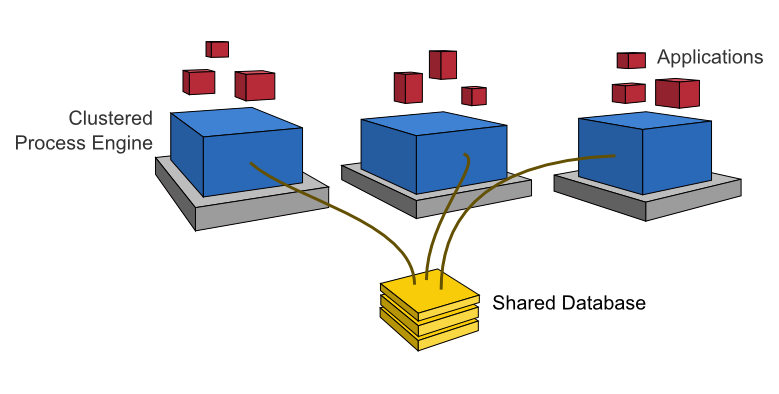

# Camunda BPM 的 Node.js 开发快速指南


## Camunda BPM 概述

Camunda 基于 Java 的 BPM 框架，支持 BPMN（工作流/过程自动化）、CMMN（事件管理）和 DMN（业务决策管理）等标准。

下图展示了 Camunda 中最重要的组件，以及典型的用户角色。


### 工作流/过程引擎（Process Engine）

- 过程引擎是一个 Java Library，用于执行 BPMN 2.0 过程、CMMN 1.1 事件和 DMN 1.3 决策表。它使用了关系数据库来做数据持久化。


### 建模器（Modeler）

- Camunda 提供了**建模器**，用于 BPMN 2.0、CMMN 1.1 的流程图建模，以及 DMN 1.3 的决策表建模。

- 也可以使用**在线的建模器**：[bpmn.io](https://bpmn.io) 来完成建模。


### Web 应用

- **REST API** 允许 Javascript 应用使用**过程引擎**，这是 Node.js 开发者使用 Camunda BPM 的方式。
- **Camunda Tasklist** 是基于 Web 的任务管理应用，它允许用户查看工作流任务，修改任务数据。
- **Camunda Cockpit** 是基于 Web 的工作流实例管理应用，它允许用户监控工作流实例，探查工作流实例的状态，修正被中断的工作流。
- **Camunda Admin** 是用户管理、组管理和授权的 Web 应用。


## Camunda BPM 平台的 Node.js 开发架构

### 独立的过程引擎服务器（Standalone/Remote Process Engine Server）


**过程引擎**作为一个独立的服务器运行，提供网络服务。远程应用（Node.js 应用）通过 REST API 和过程引擎进行交互。


### 集群模式（Clustering Model）

**过程引擎**也支持集群部署，每个**过程引擎**实例必须连接到同一个共享的数据库。




## Camunda BPM 的部署

### Camunda BPM 的发布

- **Full Distribution** 是以 **WAR** 形式发布的版本，它需要运行在 Java 应用服务器上，例如：Wildfly 或者 Tomcat。部署 **Full Distribution** 需要一定的 Java 开发基础，对 Node.js 开发者不友好。
- **Camunda BPM Run** 是预先打包好的 spring boot 应用，包括：Camunda BPM Platform 和 REST API，无需任何 Java 开发知识，就可以部署。


### Docker 部署

**Camunda BPM Run** 的部署固然不需要 Java Application Server，但是仍然离不开 Java 环境：运行 Camunda BPM Run 需要 **Java Runtime Environment 8+**。

采用 Docker 部署可以进一步简化部署过程：Camunda 已经预先将运行环境和 Camunda BPM Run 打包成 Docker 镜像，发布在 [hub.docker.com](https://hub.docker.com/r/camunda/camunda-bpm-platform) 上，只需要运行以下命令，就可以方便的部署最新的 Camunda BPM Run。

```bash
docker pull camunda/camunda-bpm-platform:run-latest
docker run -d --name camunda -p 8080:8080 camunda/camunda-platform:run-latest
```

部署成功后，可以通过：

- http://localhost:8080/camunda/app/ 来访问 Camunda webapps（Cockpit，Tasklist，Admin）
- http://localhost:8080/engine-rest/engine 来访问 REST API


## Camunda BPM Run 的配置

